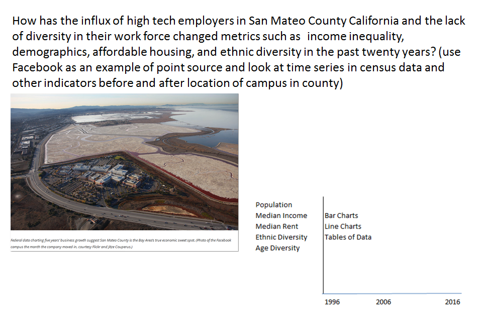

Link to website: https://juli2017.github.io/simple-page/  
# How is the Tech Boom Changing San Mateo County?  
"The Bay Area’s information-technology sector is gaining workers and wealth much faster even than the nation. But perhaps improbably, it is less-populous and -prominent San Mateo County, long squashed between its rivalrous county siblings, that emerges as poster child of swift change. Employment in its IT sector grew nearly 52 percent over five years, and the sector’s payroll almost tripled, expanding from $3.3 billion in 2009 to $11.8 billion in 2013, according to Census Bureau data."  
Source: <a href="http://www.siliconvalleyoneworld.com/2015/05/28/san-mateo-county-leads-economic-growth/">San Mateo County Leads Bay Area Economic Growth</a>   

Between 2010 and 2014, San Mateo County added 54,600 new jobs, but only added 2,200 new housing units. As a result, San Mateo County is tied with San Francisco and Marin Counties for having the highest rental costs in the U.S. The rapid growth of the IT sector is having a profound affect on the the daily lives of San Mateo County residents.  The jobs/housing imbalance along with growing income inequality and increasing use of foreign workers in the IT sector can make it feel like a zero-sum game with winners and losers. A recent poll showed that 40% of Bay Area residents are now wanting to leave the area.  
Source: <a href="https://www.usatoday.com/story/tech/2014/11/03/east-palo-alto-philanthropy-facebook-silicon-valley/16244117/">Struggling in the shadow of Silicon Valley wealth</a>  
Source: <a href="http://sf.curbed.com/2017/3/31/15140036/bay-area-leaving-poll-san-francisco">Forty percent of the Bay Area wants to leave, says new poll</a>
# San Mateo County is Geographically Diverse  
San Mateo County is <a href="https://juli2017.github.io/SMCGeographicDiversity/">spatially diverse</a> with coastal areas in the west having lower population density, lower housing density and lower median household income than the area to the east of the Santa Cruz Mountains near San Francisco Bay. The western side of San Mateo County tends toward more rural uses like agriculture, game preserve, watershed, parks and undeveloped land. The more densely populated eastern half houses more major transportation arteries and facilities, including Interstate 280, Highway 101, the Dumbarton and Hayward-San Mateo bridges, San Francisco International Airport and the Port of Redwood City.  <a href="https://www.smcgov.org/sites/smcgov.org/files/documents/files/County_Profile_2015_17.pdf">Source: County of San Mateo 2015-2017 Profile</a>

uburban versus urban.  Where the large employers are. Room for a diverse population socioeconomically. Tech Boom making the entire county more homogenous? Older people on fixed incomes and people in less skilled and lower salaried jobs could coeexist. 

<a href="https://public.tableau.com/profile/publish/Job_growth_SV_and_nearby/Finalforpub#!/publish-confirm">Most of the new jobs in the region will not pay enough to afford a two-bedroom apartment in Menlo Park and the rest of San Mateo County (visualization by Farida Jhabvala)</a>
 

# Where are the Largest Tech Employers in San Mateo County?  

<iframe src="https://juli2017.github.io/EmployerPointMap/" width="90%" height="400"></iframe>  

<a href="https://juli2017.github.io/SMCEvolutionofIT/">Timeline of the Spread of IT Employers in the County</a>  

# Who is getting the new jobs?
<a href="https://juli2017.github.io/WhoIsWorking">Trends in H1B Visas in San Mateo and adjacent Counties</a>

# How is job growth affecting how we get to work?
<a href="https://juli2017.github.io/SMCTraffic/">How is job growth affecting commute traffic?</a>

# How is job growth affecting where we can we afford to live?
<a href="https://juli2017.github.io/TrendsInRent/">How has job growth affected housing affordability?</a>

# How is our population changing?
<a href="https://juli2017.github.io/PopulationChange/">How has job growth affected population dynamics?</a>

# News Articles
* 4 June 2013: <a href="http://archives.sfexaminer.com/sanfrancisco/san-mateo-countys-economic-inequality-growing-new-report-says/Content?oid=2350398">San Mateo County’s economic inequality growing, new report says </a>  
* 3 July 2013: <a href="http://www.webpronews.com/facebook-and-its-ipo-made-san-mateo-county-the-highest-paid-county-in-america-2013-07/">Facebook and Its IPO Made San Mateo County the Highest-Paid County in America</a>  
* 23 September 2013: <a href="http://valleywag.gawker.com/a-tale-of-two-san-mateo-counties-1372560841">A Tale of Two San Mateo Counties</a>  
* 27 September 2013: <a href="http://www.modernluxury.com/san-francisco/story/the-care-and-feeding-of-tech-boom">The Care and Feeding of a Tech Boom</a>  
* 28 August 2014: <a href="http://www.mercurynews.com/2014/08/28/can-working-class-families-afford-to-live-in-san-mateo-county/">Can working-class families afford to live in San Mateo County? </a>  
* 22 July 2016: <a href="http://www.nbcbayarea.com/news/local/Facebook-not-good-neighbor-menlo-park-aclu-public-advocates-387805951.html">Facebook Not Being A Good Neighbor in Menlo Park, ACLU and Public Advocates Claim</a>  
* 7 December 2016: <a href="http://www.mercurynews.com/2016/12/07/more-bay-area-residents-struggling-than-poverty-statistics-indicate/">More Bay Area residents struggling than poverty statistics indicate</a>  
# Original Idea for the story  
  

# What I learned in this course  
I am personally experiencing the effects of the Tech Boom in San Mateo County as a long-term resident, seeing rapid change around me every day.  The relocation of Facebook from Palo Alto to San Mateo County in 2011 is highly correlated with the rapid chages brought on by the tech boom throughout the county.  They are certainly not alone in driving the change, but their impact on the county is well-reported and controversial.  Their latest plans for expansion in Menlo Park have sparked an active debate concerning the role of high tech companies in creating the job/housing imbalance in San Mateo County.   
In telling this story I decided to blend data visulizations with newpaper stories and headlines to show how the story has evolved over time.  I had zero experiece with website creation prior to this course, but some experience with data visualization as a data analyst.  I have seen static graphs that show rising rents, increased traffic, the controversy over H1B workers in high tech, and the changing population characteristics of the place I live as more and more people are forced to move because they can no longer afford to live here.  
The difference between a line chart, a printed news story and an interactive map in conveying information about things that change in space over time has been a revelation to me.  I intentionally put them side by side in my story, with a particular example in the part about rising rents.  I knew that H1B visa workers were a significant part of the high tech workforce, but the bar charts graphically showed the dramatic increase over time among adjacent counties in a way that a news headline cannot.  Visualizing data in the different ways we learned in this course allow me to show not just the what of the story, but also the where and when.  
What occupantion a person pursues in San Mateo County, and how much money they make, can now greatly influence where they can afford to live and how far they have to commute to work every day.  This in turn affects traffic congestion and ridership and overcrowding on public transit.  Maps help to show the complex interactions between these statistical indicators of change.  
I had to scale back the time dimesnion of my story from 20 years to 10 years, and found access to the data sets a major constraint.  I also ended up adding regional data, because what is happening in one county affects all of the surrounding coutines as well.  In San Mateo the rate of change is so rapid that the time lag in making census data available makes it hard to keep the metrics current.  I had to give up on using Google Sheets for several of my charts, because I know how to use Excel and was frustrated by the diffrence in functionality.
